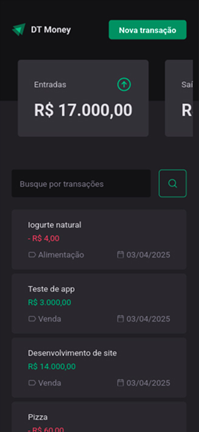
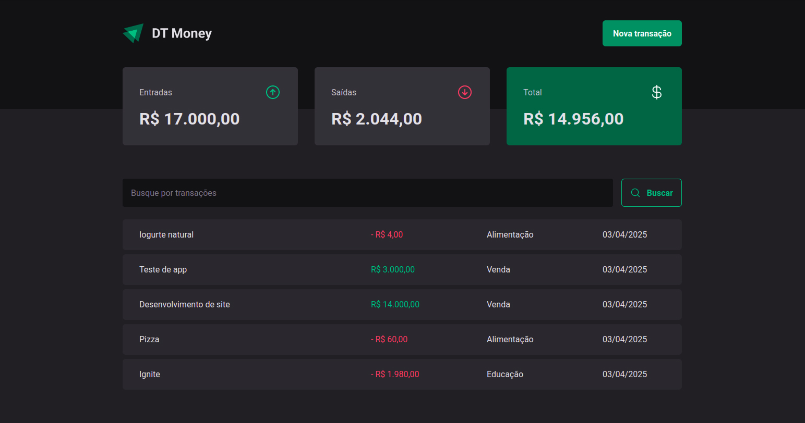

# Ignite Rocketseat - DT Money

💰 Financial Control App: An application to track income and expense transactions, organized by categories.
Developed while following the [Rocketseat](https://www.rocketseat.com.br/) classes.

## Table of contents

- [Overview](#overview)
  - [The challenge](#the-challenge)
  - [Screenshot](#screenshot)
- [My process](#my-process)
  - [Built with](#built-with)
  - [What I learned](#what-i-learned)
  - [Useful resources](#useful-resources)

## Overview

### Features
Users should be able to:

- View the optimal layout for the app depending on their device's screen size
- See their list of transactions and a price summary, based on either the full list or filtered search results
- Add new transactions, whether income or outcome

### Screenshot

## My process

### Built with

- [React](https://reactjs.org/) - JS library
- [Typescript](https://www.typescriptlang.org/)
- [Vite](https://vitejs.dev/)
- [Styled component](https://styled-components.com/)
- [Radix UI](https://www.radix-ui.com/)
- [React Hook Form](https://react-hook-form.com/)
- [Zod](https://zod.dev/)
- [use-context-selector](https://www.npmjs.com/package/use-context-selector)
- [Axios](https://axios-http.com/ptbr/docs/intro)
- [Phosphor Icons](https://phosphoricons.com/)
- [Json server](https://github.com/typicode/json-server/tree/v0)

### What I learned

- Used useCallback to improve performance by memoizing functions like createTransaction and fetchTransactions;
- Applied use-context-selector to optimize context usage;
- Leveraged useMemo to reduce computation in transaction summaries;
- Handled controlled components (e.g., radio groups) using Controller from react-hook-form;
  
### Useful resources

- [Responsividade na Prática | Masterclass #08](https://www.youtube.com/watch?v=H91DhKPjhPk) - This helped me for to create responsive design.
- [Rocketseat](https://www.rocketseat.com.br/) To React classes

